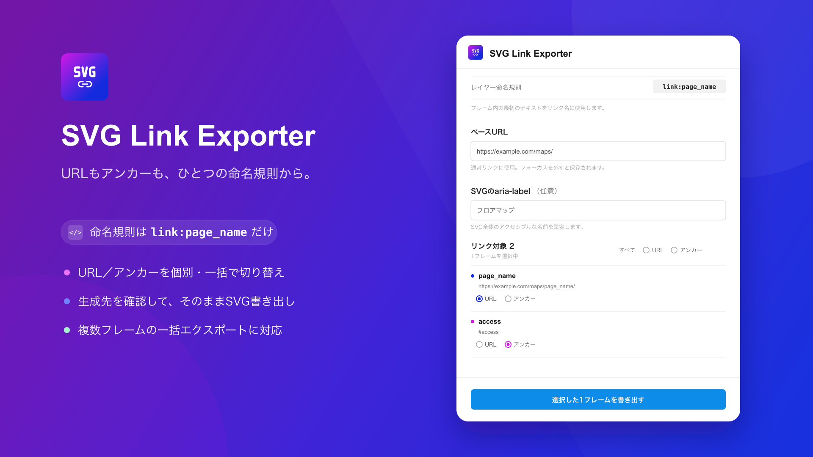

#  SVG Link Exporter



Figmaのレイヤー名と任意のベースURLからリンクを生成し、クリック領域を含むSVGを書き出すプラグインです。

## 使い方

1. 通常リンクとして使う場合は、プラグインでベースURLを設定する
2. ラベルを囲むフレーム名を `link:パス` に変更する
3. 書き出したいフレームを1つ以上選択する
4. 「選択フレームを書き出す」を押す

検出された対象は、プラグインUIのラジオボタンから「リンク」と「アンカー」を個別に切り替えられます。検出対象すべての一括切り替えにも対応しています。選択した種別はFigmaファイル内に保存されます。

SVG全体の `aria-label` はプラグインUIからフレームごとに任意設定できます。SVGのネイティブなロールを維持するため、`role` 属性は追加しません。

例えばベースURLを `https://www.example.com/onsen/` に設定した場合、`link:sample_onsen` は次のURLになります。

`https://www.example.com/onsen/sample_onsen/`

`link:access` をUIで「アンカー」に設定すると、ページ内アンカーへのリンクとして次の値になります。アンカーリンクだけを使う場合、ベースURLの設定は不要です。

`#access`

アクセシビリティ用の日本語名には、フレーム内で最初に見つかったテキストを使用します。`link:` がないレイヤーはリンク対象になりません。

以前の `anchor:` 形式も読み込めます。UIで種別を変更すると `link:` 形式に自動的に統一されます。

従来の `link:yunokawa_onsen|湯の川温泉` 形式にも対応しています。

Figmaのレイヤー名はリンク判定にだけ使用し、書き出したSVGのIDには含めません。

ベースURLはFigmaの `clientStorage` にローカル保存されます。

## 開発

```bash
npm install
npm run build
npm run watch
```

Figmaデスクトップ版の `Plugins > Development` からこのプラグインを実行します。
